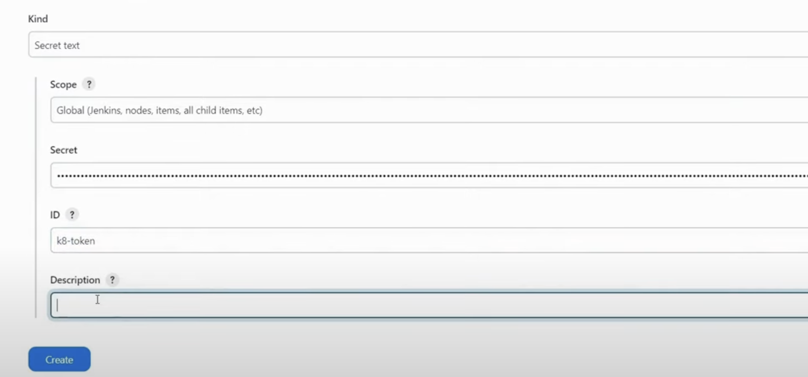
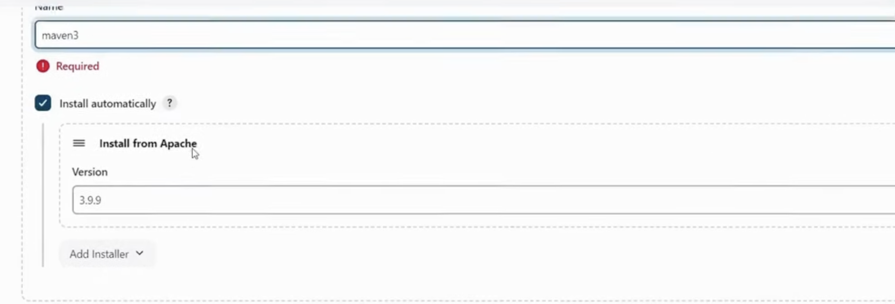
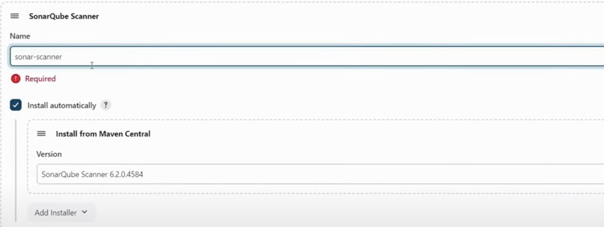
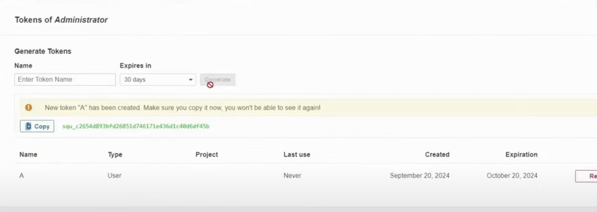
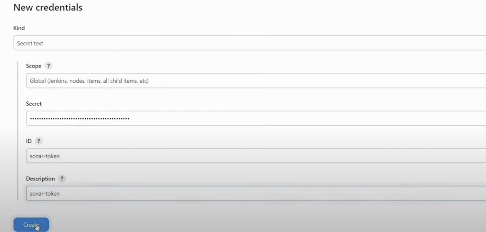
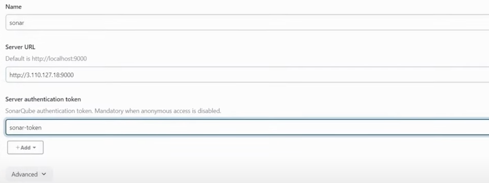

# Blue-Green-Deployment

* **Two Environments** :

  1. **Blue** : Current live version (production).
  2. **Green** : New version to be deployed.
* **Deployment Process** :

  1. Deploy new version to **Green** environment.
  2. Test the Green environment (e.g., functional tests).
  3. Switch traffic from **Blue** to **Green** (e.g., via load balancer).
  4. **Green** is now live, **Blue** is idle.
* **Rollback** :

  * If there’s an issue with **Green**, quickly switch back to  **Blue** .
* **Benefits** :

  * **Zero downtime** for users.
  * Easy and fast **rollback** if problems arise.
  * **Reduced risk** of introducing bugs into production.
  * Supports **Continuous Delivery** practices.
* **Considerations** :

  * Requires extra resources (2 environments running).
  * Must handle **database migrations** carefully.

#### **Goal** : Safe, smooth deployments with minimal user disruption.

### Steps to Deploy Blue-Green Deployment on AWS

### Create Security Group


### Create 4 EC2 instances

1. Jenkins
2. SonarQube
3. Nexus
4. Server

#### Setup Server Instance

* Update Server

  ```
  sudo apt update -y
  ```
* Install AWS cli

  ```
  curl "https://awscli.amazonaws.com/awscli-exe-linux-x86_64.zip" -o "awscliv2.zip"
  unzip awscliv2.zip
  sudo ./aws/install
  ```
* Configure AWS Credentials

  ```
  aws configure
  ```

  1. Access Key
  2. Secret Access Key
  3. Region
* Install Terraform

  ```
  sudo apt-get update && sudo apt-get install -y gnupg software-properties-common
  wget -O- https://apt.releases.hashicorp.com/gpg | \
  gpg --dearmor | \
  sudo tee /usr/share/keyrings/hashicorp-archive-keyring.gpg > /dev/null
  echo "deb [signed-by=/usr/share/keyrings/hashicorp-archive-keyring.gpg] \
  https://apt.releases.hashicorp.com $(lsb_release -cs) main" | \
  sudo tee /etc/apt/sources.list.d/hashicorp.list
  sudo apt update -y
  sudo apt-get install terraform -y
  ```
* Clone The Repo
* Modify Files

  1. variables.tf (Modify Private Key Name)
  2. main.tf (Modify Region name & Availabilty Zones)
* Apply Terraform Lifecycle

  1. `terraform init`
  2. `terraform plan`
  3. `terraform apply --auto-approve`
* Install kubectl
* Update kubeconfig for cluster

  ```
  aws eks update-kubeconfig --region region-code --name my-cluster
  ```

#### Setup Jenkins Server

* Run the script

  ```
  sudo bash jenkins.sh
  ```
* Install Docker

  ```
  # Add Docker's official GPG key:
  sudo apt-get update
  sudo apt-get install ca-certificates curl
  sudo install -m 0755 -d /etc/apt/keyrings
  sudo curl -fsSL https://download.docker.com/linux/ubuntu/gpg -o /etc/apt/keyrings/docker.asc
  sudo chmod a+r /etc/apt/keyrings/docker.asc

  # Add the repository to Apt sources:
  echo \
    "deb [arch=$(dpkg --print-architecture) signed-by=/etc/apt/keyrings/docker.asc] https://download.docker.com/linux/ubuntu \
    $(. /etc/os-release && echo "$VERSION_CODENAME") stable" | \
    sudo tee /etc/apt/sources.list.d/docker.list > /dev/null
  sudo apt-get update -y
  ```

  ```
  sudo apt-get install docker-ce docker-ce-cli containerd.io docker-buildx-plugin docker-compose-plugin
  ```
* Give permissions to jenkins user to run docker commands

  ```
  sudo usermod -aG docker jenkins
  ```
* Restart Jenkins
* Install Trivy

  ```
  sudo apt-get install wget apt-transport-https gnupg lsb-release
  wget -qO - https://aquasecurity.github.io/trivy-repo/deb/public.key | sudo apt-key add -
  echo deb https://aquasecurity.github.io/trivy-repo/deb $(lsb_release -sc) main | sudo tee -a /etc/apt/sources.list.d/trivy.list
  sudo apt-get update -y
  sudo apt-get install trivy -y
  ```
* Install kubectl on Jenkins & Server Instance

  ```
  sudo apt-get update
  # apt-transport-https may be a dummy package; if so, you can skip that package
  sudo apt-get install -y apt-transport-https ca-certificates curl gnupg
  ```

  ```
  curl -fsSL https://pkgs.k8s.io/core:/stable:/v1.31/deb/Release.key | sudo gpg --dearmor -o /etc/apt/keyrings/kubernetes-apt-keyring.gpg
  sudo chmod 644 /etc/apt/keyrings/kubernetes-apt-keyring.gpg
  ```

  ```
  echo 'deb [signed-by=/etc/apt/keyrings/kubernetes-apt-keyring.gpg] https://pkgs.k8s.io/core:/stable:/v1.31/deb/ /' | sudo tee /etc/apt/sources.list.d/kubernetes.list
  sudo chmod 644 /etc/apt/sources.list.d/kubernetes.list
  ```

  ```
  sudo apt-get update -y
  sudo apt-get install -y kubectl
  ```

#### Setup Nexus Server

1. Update the server

   ```
   sudo apt update -y
   ```
2. Install Docker

   ```
   # Add Docker's official GPG key:
   sudo apt-get update
   sudo apt-get install ca-certificates curl
   sudo install -m 0755 -d /etc/apt/keyrings
   sudo curl -fsSL https://download.docker.com/linux/ubuntu/gpg -o /etc/apt/keyrings/docker.asc
   sudo chmod a+r /etc/apt/keyrings/docker.asc

   # Add the repository to Apt sources:
   echo \
     "deb [arch=$(dpkg --print-architecture) signed-by=/etc/apt/keyrings/docker.asc] https://download.docker.com/linux/ubuntu \
     $(. /etc/os-release && echo "$VERSION_CODENAME") stable" | \
     sudo tee /etc/apt/sources.list.d/docker.list > /dev/null
   sudo apt-get update -y
   ```

   ```
   sudo apt-get install docker-ce docker-ce-cli containerd.io docker-buildx-plugin docker-compose-plugin -y
   ```
3. Give permissions to Ubuntu user to run Docker commands

   ```
   sudo usermond -aG docker ubuntu
   newgrp docker
   ```
4. Create a Nexus Container

   ```
   docker run -d -p 8081:8081 sonatype/nexus3
   ```
5. Check if docker container is created succesfully

   ```
   docker ps
   ```
6. Take access of Container

   ```
   docker exect -it <container ID> /bin/bash
   ```
7. Copy and Store admin password for login purpose

   ```
   cat sonatype-work/nexus3/admin.password
   ```

#### Setup SonarQube Server

1. Update the Server

   ```
   sudo apt update
   ```
2. Install Docker

   ```
   # Add Docker's official GPG key:
   sudo apt-get update
   sudo apt-get install ca-certificates curl
   sudo install -m 0755 -d /etc/apt/keyrings
   sudo curl -fsSL https://download.docker.com/linux/ubuntu/gpg -o /etc/apt/keyrings/docker.asc
   sudo chmod a+r /etc/apt/keyrings/docker.asc

   # Add the repository to Apt sources:
   echo \
     "deb [arch=$(dpkg --print-architecture) signed-by=/etc/apt/keyrings/docker.asc] https://download.docker.com/linux/ubuntu \
     $(. /etc/os-release && echo "$VERSION_CODENAME") stable" | \
     sudo tee /etc/apt/sources.list.d/docker.list > /dev/null
   sudo apt-get update -y
   ```

   ```
   sudo apt-get install docker-ce docker-ce-cli containerd.io docker-buildx-plugin docker-compose-plugin -y
   ```
3. Give permission to ubuntu user to run docker commands

   ```
   sudo usermod -aG docker ubuntu
   newgrp docker
   ```
4. Create container of SonarQube

   ```
   docker run -d -p 9000:9000 sonarqube:lts-community
   ```
5. Check container is in running state or not

   ```
   docker ps
   ```

#### Create pods,svc & namespace

1. Create a namespace

   ```
   kubectl create ns webapps
   ```
2. Run following command

   ```
   kubectl apply -f svc/
   ```
3. Copy token genrated using following command

   ```
   kubectl describe secret mysecretname -n webapps
   ```

#### Configure Jenkins

1. Add the token into jenkins credentials

* Go to manage Jenkins
* Go to Credentials (Global)
* Add Credentials



2. Install Plugin in Jenkins

* `SonarQube Scanner`
* `Config file provider`
* `Maven Integration` & `Pipeline Maven Integration`
* `Pipeline stage view`
* `Docker pipeline`
* `Kubernetes`,`Kubernetes CLI`,`Kubernetes Credentials`,`Kubernetes Client API`

3. Add Maven and SonarQube Scanner Configuration into Jenkins

    



4. Go to SonarQube and Generate the Token

   Go to SonarQube Administration Tab
   Then Security,Users and then Token

   
5. Add above token into the Jenkins Credentials

   
6. Add Sonar-server configuration into Jenkins(System-SonarQube Installation)

   
7. Create New configuration for maven in Jenkins

* Go to managed files
* Click on Add new config
* Select Global maven settings
* Give id name as `maven-settings`
* Add
